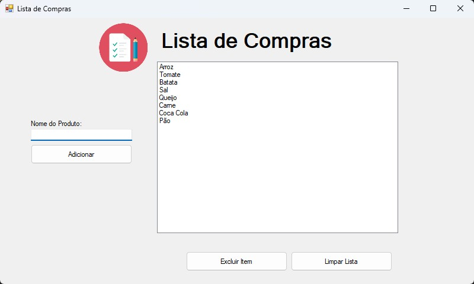

# 🛒 Lista de Compras - Windows Forms em C#

Este é um projeto simples e funcional de **gerenciamento de lista de compras**, desenvolvido em **C# utilizando Windows Forms**. Ele oferece uma interface gráfica intuitiva para adicionar, remover e limpar itens da lista de forma segura e prática.

## 📸 Captura de Tela



## 🔧 Funcionalidades

- ✅ **Adicionar Itens à Lista**
  - Insira o nome do item na `TextBox` e adicione com um botão.
  - Verificação para evitar a adição de **itens repetidos**.

- 🗑️ **Remover Itens Selecionados**
  - Seleciona um ou mais itens no `ListBox` e remova com um clique.

- 🧹 **Limpar Toda a Lista**
  - Remove todos os itens do `ListBox`.
  - Inclui **mensagem de confirmação** para evitar exclusões acidentais.

- 🔒 **Validações de Segurança**
  - Bloqueia a inserção de itens em branco ou duplicados.
  - Confirmação antes de limpar toda a lista.

## 🖥️ Componentes Utilizados

- `TextBox`: Entrada para novos itens.
- `ListBox`: Exibição dos itens da lista.
- `Buttons`: Ações de adicionar, excluir e limpar.
- `MessageBox`: Diálogos de confirmação e mensagens de erro.

## 🛠️ Como Executar

1. **Clone o repositório:**

   ```bash
   git clone https://github.com/seu-usuario/seu-repositorio.git